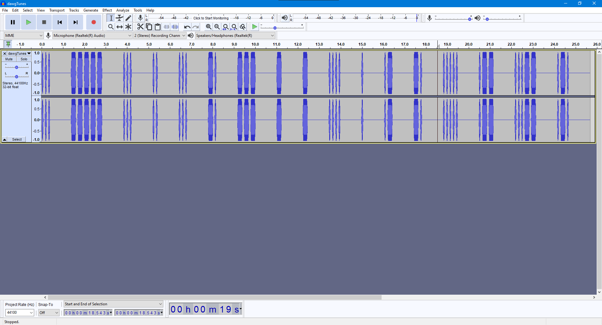

# Deserted Island Toolkit

## Description

What would a drunken sailor do? (Wrap the output in DawgCTF{ })

DesertedIslandToolkit.zip: [https://drive.google.com/file/d/1vYUIAPIeQgE6x781tH6SU3uU0YSx5Yxv/view?usp=sharing](./DesertedIslandToolkit.zip)

Author: Eyeclept

## Approach

Due to trust issues (which came in handy this time), use [7zip](https://www.7-zip.org/) to open the zip file. Inside there's `dawgTunes.iso` which can also be opened with 7zip and inside that there's `dawgTunes.cdda` and `.checksum.md5`. Let's extract `dawgTunes.cdda`.

After a bit of research (read 30 seconds of Googling), we learn [.cdda files](https://www.lifewire.com/cdda-file-2620184) are some Apple audio file because capitalism or something, idk, Apple is wack.

We can use [conertio](https://convertio.co/cdda-mp3/) to convert a cdda to a mp3 file. File is [here](./dawgTunes.mp3)

[`dawgTunes.mpg`](./dawgTunes.mp3) sounds like Morse code. There's many ways to convert Morse code to text. I opened the file in [Audacity](https://www.audacityteam.org/) to see all the sounds:

This is: `... ----- ... .. ... -. --- - - .... . .- -. ..... .-- ...-- .-.` which we can then put into [Morse Code World Translator](https://morsecode.world/international/translator.html) which gives us the a string. Wrap it in flag format and there's the flag.

## Flag

DawgCTF{S0SISNOTTHEAN5W3R}
