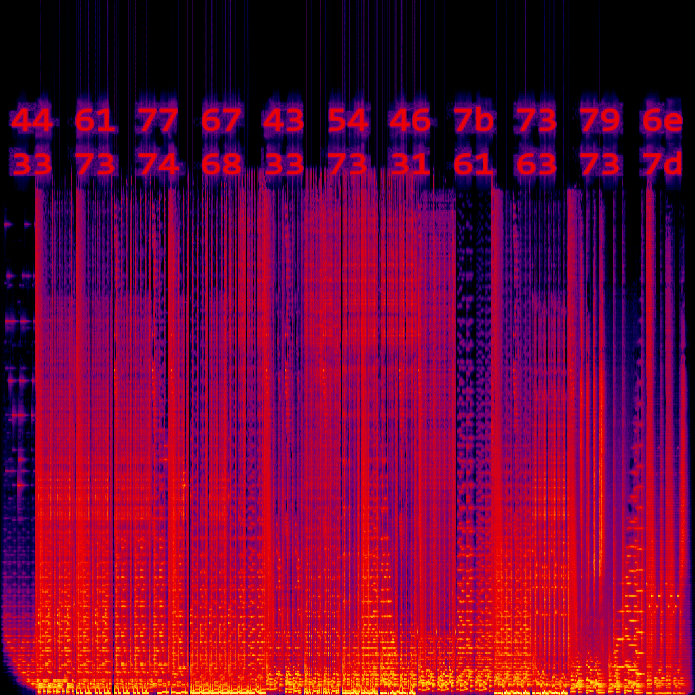

# Third Eye

## Description

This beat is making me see things that I didn't think I could see...

third_eye.mp3: [https://drive.google.com/file/d/13Je41zqYscApr-f6GJ5kC8RjeRP6hjUi/view?usp=sharing](third_eye.mp3)

Author: Noodle

## Approach

Use [this site](https://convert.ing-now.com/audio-spectrogram-creator/) to convert the audio file to an image. Here's the image:

These look like hex values: 44 61 77 67 43 54 46 7b 73 79 6e 33 73 74 68 33 73 31 61 63 73 7d

Use any method to [convert hex to ascii](https://www.rapidtables.com/convert/number/hex-to-ascii.html) and that's the flag.

## Flag

DawgCTF{syn3sth3s1acs}
