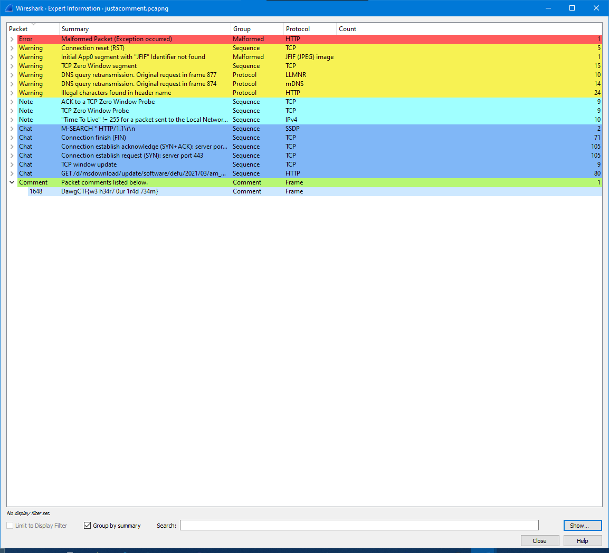

# Just A Comment

## Description

Just a comment, we love our people here at ClearEdge!

justacomment.pcapng: [https://drive.google.com/file/d/1vcLdCLi-zYTe_WPtXyu2Gr3rM0a3Ct7h/view?usp=sharing](./justacomment.pcapng)

Author: Clearedge

## Approach

Open the network capture file with [Wireshark](https://www.wireshark.org/). *Realize Wireshark has a [commenting feature](https://packetu.com/2013/06/18/using-the-wireshark-commenting-feature/) which you can find in the bottom left corner of the screen and gives you a popup that looks like:*

...ouch...I'm definitely not triggered.

## Flag

DawgCTF{w3 h34r7 0ur 1r4d 734m}
